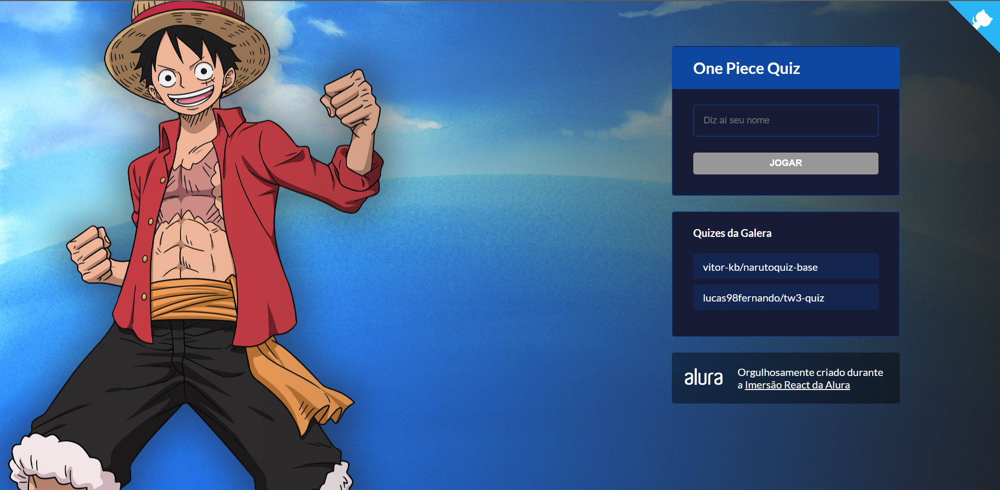
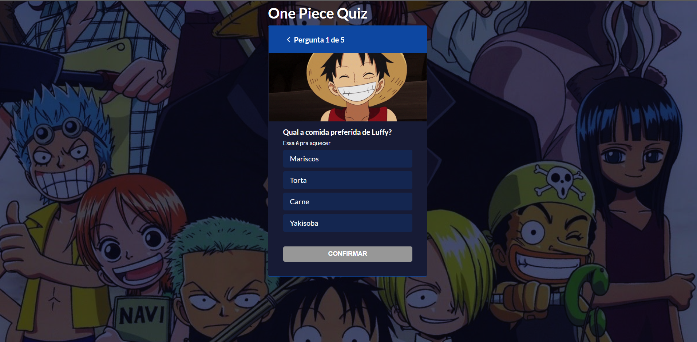

<h1 align="center">

 
One Piece Quiz
</h1>

Um simples sistema de quiz sobre um mangá/anime japonês

  

[//]: # (Add your gifs/images here:)

   
  

## Features
[//]: # (Add the features of your project here:)
Nessa aplicação foram utilizados as seguintes tecnologias abaixo:

- **React Js** — Uma biblioteca para construção de interfaces web
- **Next Js** — Uma framework react para construção de interfaces web com a tecnologia SSR
- **Styled Components** - Um pacote que auxilia nas estilizações das páginas, permite escrever código CSS em arquivos javascript
- **Framer Motion** - Um pacote que auxilia nas animações dos componentes das páginas
- **Typescript** - Uma linguagem de programação fortemente tipada.

## Getting started

Primeiro faça o clone do repositório:  
    `git clone {url repositório}`   
Entre na pasta do projeto:  
    `cd onepiecequiz`   
Execute o comando para baixar os pacotes:  
    `yarn` ou `npm`   
Agora inicie o projeto:  
    `yarn dev` ou `npm run dev`   

## License

This project is licensed under the MIT License - see the [LICENSE](https://opensource.org/licenses/MIT) page for details.
